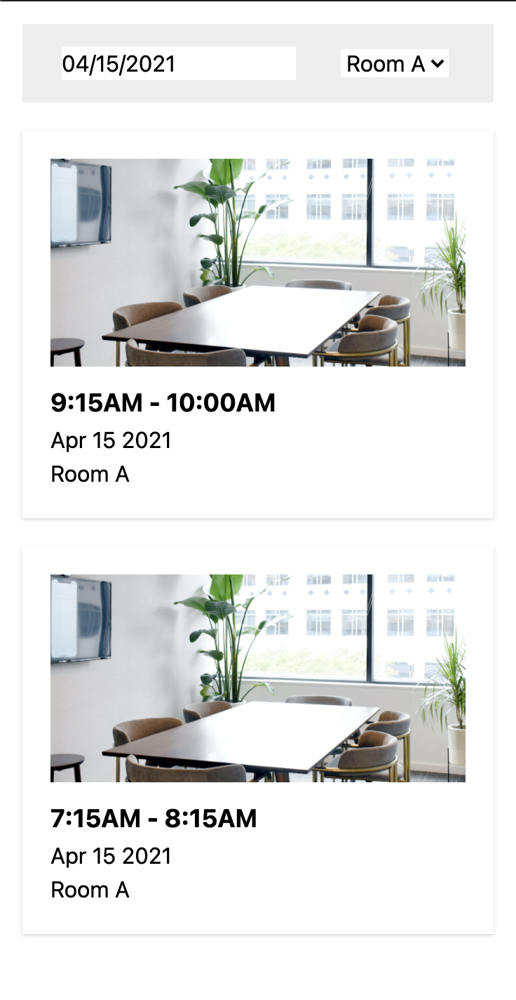

# Cove Full Stack Engineer Coding Challenge

Welcome to the Cove coding challenge! 👋

Adam just signed a deal with a large real estate owner 🎉. Before we can launch our *powered by Cove* platform in their office building, we need to set up a reservation system.

### Problem Statement

In our backlog grooming session, Jeremy (our Product Manager) presented the problem we aim to solve for our users:

> *As Angela at Allsafe (an office user), I want to book the large conference room for a strategy meeting and need to find a time when it's available.*

The team broke this problem down and prioritized this User Story:

* **User Story:** As an office user, I want to view the schedule for a selected room and date so that I can find an available time slot.

### Your Task

We have provided you with a basic application designed to display a list of reservations and allow users to filter them by date and room. Your challenge is to complete this application so it works as intended.

If you have questions along the way, please reach out to us.

---

## Getting Started

1. Install dependencies:

   ```bash
   yarn
   ```
2. Start the application:

   ```bash
   yarn start
   ```

---

## Part 1: Connect Components

### Objective

* Connect the existing components using React hooks.
* Use the `useMemo` hook for optimized rendering. [Read about `useMemo` here.](https://react.dev/reference/react/useMemo)

### Instructions

* Manage state for the filters (`DatePicker` and `DropDownSelect`).
* Fetch a list of reservations from the API: [Reservation API](https://cove-coding-challenge-api.herokuapp.com/reservations)
* Populate the `DropDownSelect` with room options (e.g., "Room A", "Room B").
* Filter the reservations based on the selected room and date, displaying them in the `ReservationList`.

### Expected Outcome

Users should be able to change the filter values and see only the reservations that match their selections.

### Approach

`DatePicker` and `DropDownSelect` components improved by extending native types.

#### Performance

Leveraging `useMemo` and `useCallback` hooks, custom hooks are created in `/hooks` folder for a clean and DRY code.
Also used `React.memo` for memorizing the components for a better performance.

#### State management & HTTP client

* `React-query` is used to manage server-side state management. I created a basic custom hook with a slate time.
* `Axios` is used as HTTP client. It's customized in `src/api/AxiosClient.ts` using interceptors for both request and responses.
* Endpoints are structured in `/api/endpoints` folder. with this structure we can have access to all endpoints in a clean way. (`CoveAPI.Endpoint.get`).

---

## Part 2: Enhance the UI

### Objective

Make the reservation list visually match the mockups provided:


Desktop:


Mobile:



### Instructions

* Implement responsive design using a CSS breakpoint for mobile and desktop views.
* Choose any styling approach you prefer:

  * [Styled Components](https://styled-components.com/)
  * [React-JSS](https://cssinjs.org/react-jss/?v=v10.6.0)
  * [Tailwind CSS](https://tailwindcss.com/)
  * SASS/LESS
  * CSS Modules
  * Plain CSS

### Approach

I used tailwindCSS for styles. there are simple loading and error components which can be improved later. 
Clicking the `DatePicker` opens the first available date (default was today). Non-available dates are disabled to improve the user experience.

---

## Part 3: Add Testing

### Objective

* Complete the `isScheduleConflict` utility to detect reservation conflicts.
* Add test coverage in `utils.test.ts`.

### Instructions

* Review the existing `isScheduleConflict` util in `utils.ts`.
* Complete the implementation to detect conflicts between reservations.
* Write additional tests in `utils.test.ts` to ensure full coverage.
* Run tests with:

  ```bash
  yarn test
  ```

### Notes

* Do not connect this util to the UI.
* Focus on readable and maintainable code, even if it is not the most efficient.

### Approach

* `vitest` for using tests - non-overlapping and conflicts tested 
* `Playwright` for E2E testing - all flows and states are tested
* `Storybook` for visual testing

Hope you like my coding style 😎

---

## Things to Improve next!


* Pagination or progressive loading helps a lot for list view
* Images can be optimized using tools like `vite-imagetools`
* Integration and API tests
* Error boundary implementation
* Add GitHub Actions workflows for continuous testing and deployment
* Add Husky for client side configuration before commits 
* Performance monitoring with React Profiler
* Add proper mocking with MSW for development and testing
* Implement proper TypeScript path aliases for cleaner imports
* Containerize the application with Docker 

## Final Steps

* Complete the "Explain your approach" sections for each part.
* Search the codebase for `TODO:` to ensure all have been addressed.

Once done, you are all set! 👏